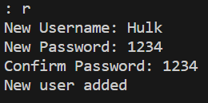
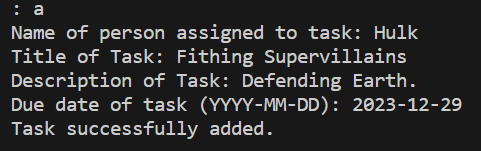
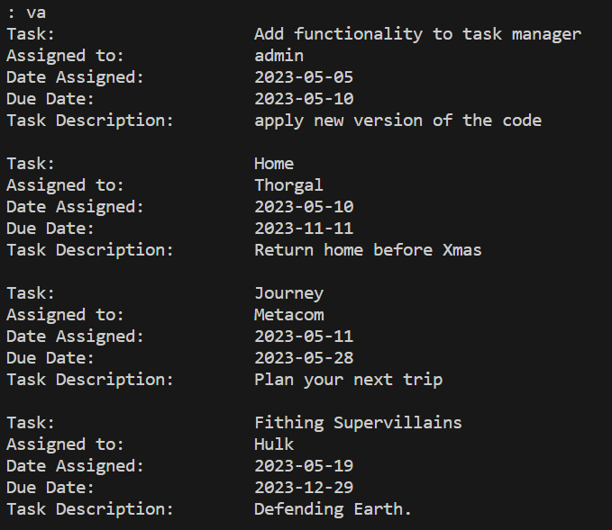
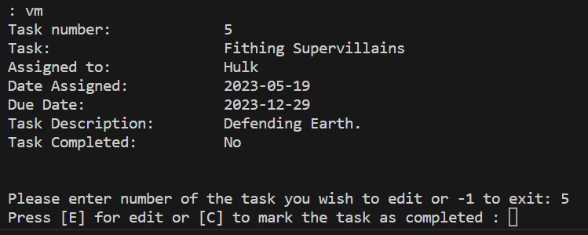
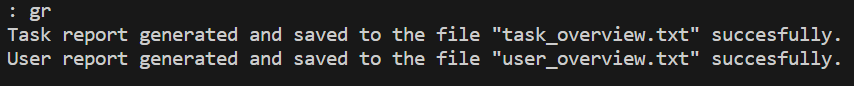
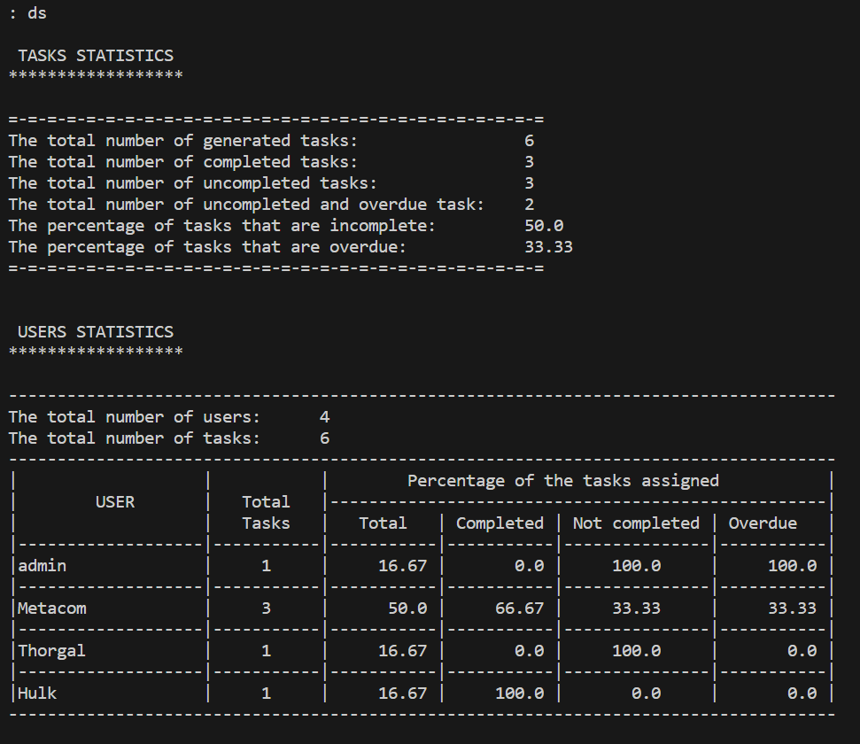

# Task Manager - Capstone project
This is project for HyperionDev lesson about Lists, Functions, and String Handling.  
Functionality: registering a user, adding a task, viewing all tasks and viewing the current user's tasks. 

## Table of content:
1. Installation
2. How to use the Task Manager
3. Credits

## Installation
The whole project is in one file - task_manager.py.
The other txt files are only examples and you don't need them as those will be created during executing the code.
Just copy the file to your desire destination and open in your compilator.

## How to use the Task Manager
On the first run, the Task Manager will create a file 'user.txt' and save there a default user 'admin' with 'qwerty' as password.
Using Task Manager you can:
- register new user,
- add task,
- view all tasks,
- view and edit tasks assigned to the currently logged user
- create reports
- view statistics if you are logged as admin user

### Registering new user
Type 'r' and press enter.
Provide user name and password (twice)
Program will check if user exist and ifboth passwords match.

### Adding new task
Type 'a' and press enter.
Enter username of the person whom the task is assigned to, a titl of a task, a description of the task and set the due date for the task.
To add task user must exists.

### Viewing all tasks
Type 'va' and press enter.
Program will display on the screen list of all tasks, username assigned to a task, the date it was assigned to a user,
due date and task description.

### Viewing (and editing) tasks currently logged user
Type 'vm' and press enter.
Function will display only tasks assigned to the user currently logged in and offer additional options to edit task or mark it as completed.
User can't edit a completed task.

### Creating reports
Type 'gr' and press enter.
Function will generate two reports and save both into separate files:
- summary about tasks to file task_overview.txt
- summary about users to file user_overview.txt

### Viewing statistics (admin user only)
Type 'ds' and press enter.
This option is available only for 'admin' user.
This function will check if the reports are generated ('Generate reports' option) and if not it will create the reports first.
Then it will load from the generated files and siplay statistics on the screen.

### Exiting the Task Manager
Type 'e' and press enter to finish working with the Task manager.

## Credits
* HyperionDev team: https://www.hyperiondev.com/
* Tomasz Wisniewski (me): tsz.wisniewski@gmail.com
